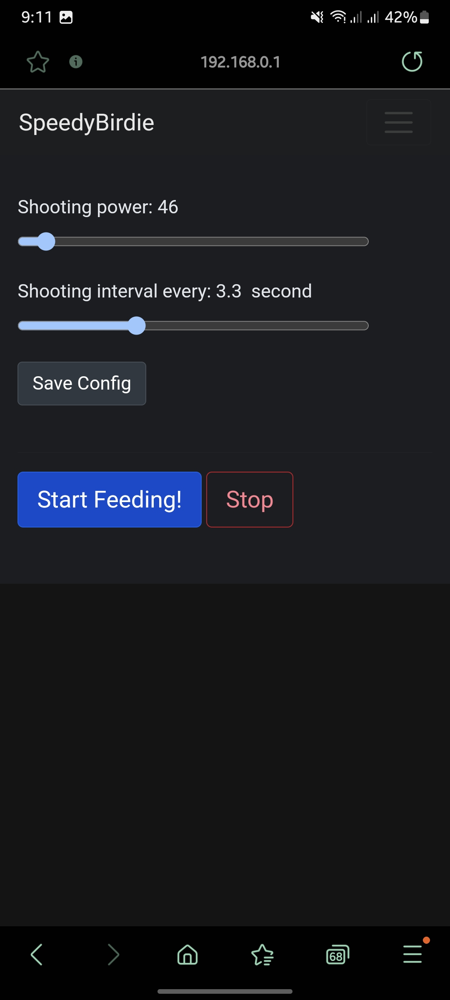

## [](https://github.com/xeonqq/SpeedyBirdie/actions/workflows/main.yml)
> An ESP8266 powered affordable open-source badminton shuttlecock launcher, most of the parts are 3D printable. 
> It can be easily configured and controlled by mobile web app.

 <!--<a class="bmc-button" target="_blank" href="https://paypal.me/xeonqq">-->

https://user-images.githubusercontent.com/4160429/230732115-2643d7fb-357c-4170-a650-556cba44c28a.mp4

> SSID: SpeedyBirdie

> password: chinasprung

> ip: 192.168.0.1

Main page (index.html)     |  Configuration page (dev.html)
:-------------------------:|:-------------------------:
  |  

### Build and Flash (on Linux)
The project depends on https://github.com/SmingHub/Sming, therefore it is easier to use docker

#### Build
```bash
git clone https://github.com/xeonqq/SpeedyBirdie
cd SpeedyBirdie

# connect the esp8266
docker-compose run --rm sming-cli
make
```

#### Flash
```bash
# when inside docker
# flash app and upload website data:
make clean && make flash 
```
Note the settings data will be erased every time a new flash happens.

#### Debug
```bash
# when inside docker
make terminal # ctrl-] to exit
```

#### Build Instruction & 3d printed parts
https://www.thingiverse.com/thing:5827863


### Sponsor Content


The SpeedyBirdie project is completely opensource, the code and STL files provides everying needed to accomplish this project. 
However, some building instruction and wiring diagram would help in some cases. As a sponsor, you would be able to enjoy the following premium content:

* We provide a comprehensive instruction manual in PDF format as well as some version 2 exlusive 3d-printable parts.

  - [SpeedyBirdie Build Instructions (Include version 2 3D printed parts)](https://payhip.com/b/13kHF)

* The pre-compiled image with flash instructions, our one-click flashable firmware ensures a smooth setup process without need of linux or docker setup.

  - [SpeedyBirdie Pre-compiled Firmware (speedybirdie.bin)](https://payhip.com/b/kO4ir)

* Or the above two together as a [bundle](https://payhip.com/b/9Ng2s).
